# 🚗 Rentaly — Araç Kiralama Yönetim Sistemi

> **N-Katmanlı Mimari** ile geliştirilmiş, modern ve kapsamlı bir araç kiralama platformu.  
> Admin paneli, kullanıcı arayüzü ve gerçek zamanlı rezervasyon yönetimi ile uçtan uca eksiksiz bir çözüm.

---

## 📸 Proje Görselleri

### 🌐 Kullanıcı Arayüzü

| Araç Listesi | Araç Detay & Kiralama |
|:-:|:-:|
| 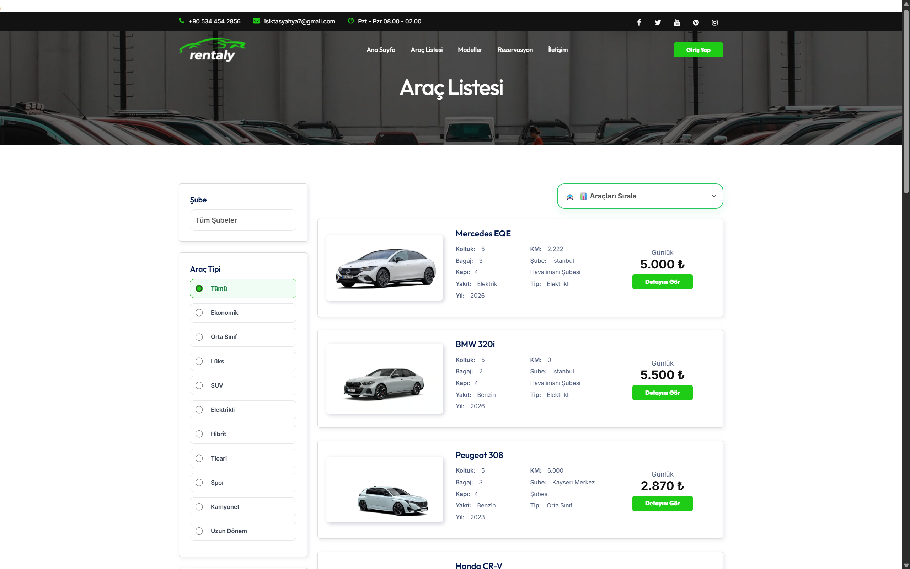 | 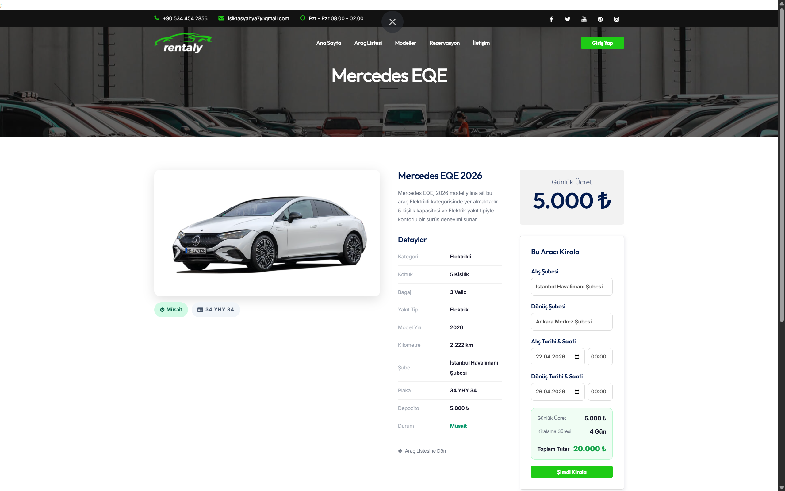 |

| Filtreli Araç Listesi | Rezervasyon Formu |
|:-:|:-:|
| 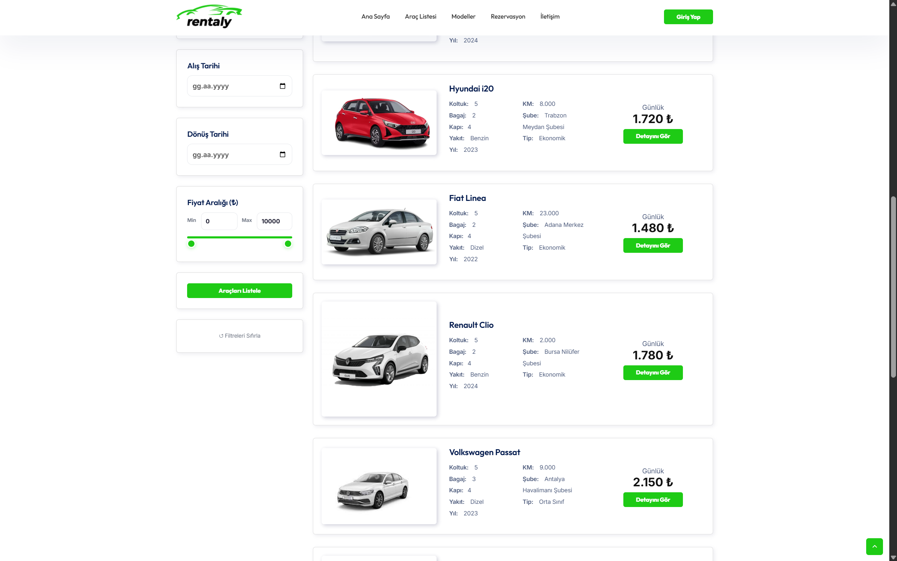 | 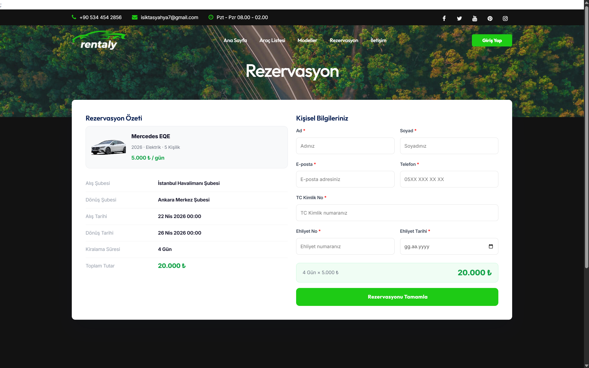 |

| Rezervasyon Tamamlandı | Onay E-Postası |
|:-:|:-:|
| 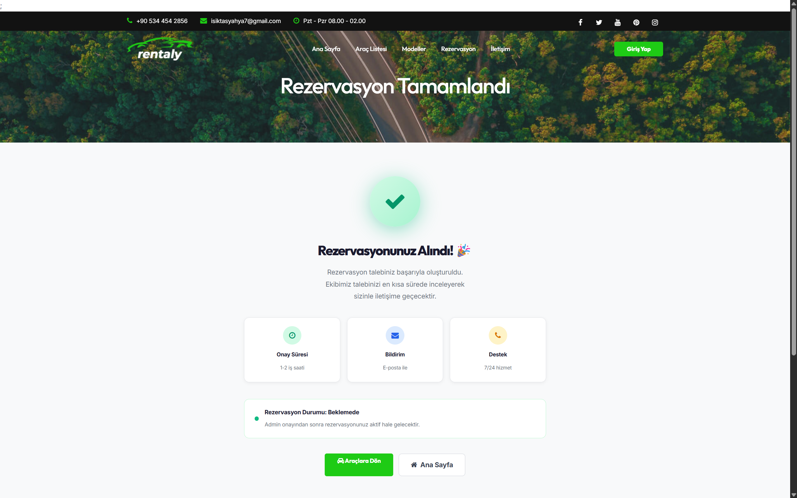 | 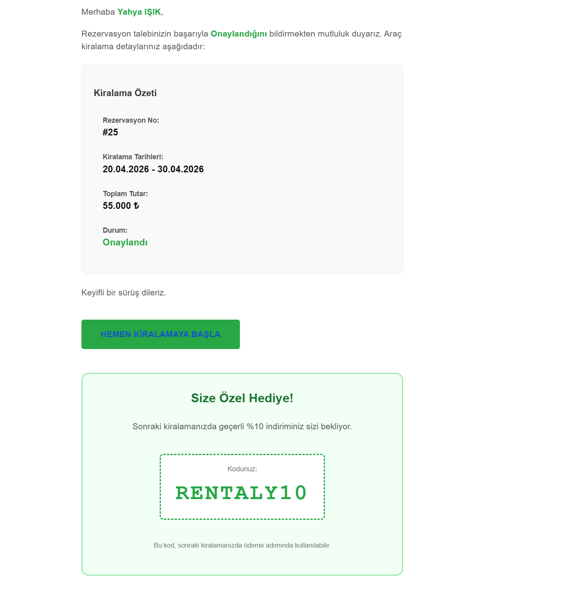 |

---

### ⚙️ Admin Paneli

| Dashboard — Gelir & İstatistikler | Son Rezervasyonlar |
|:-:|:-:|
| 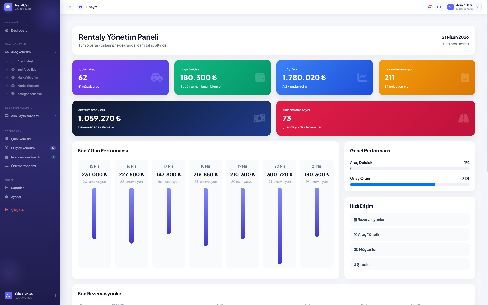 | 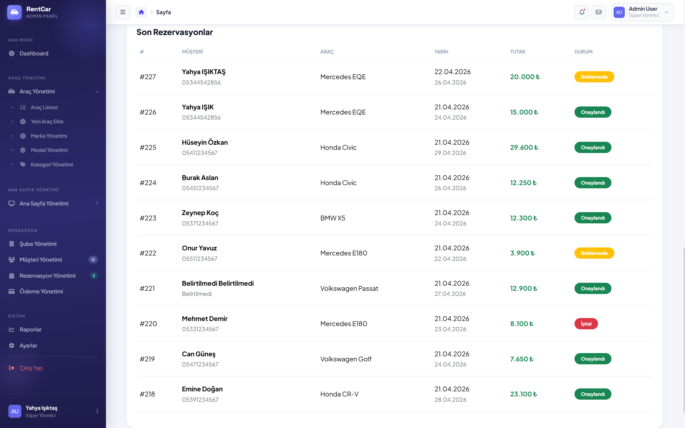 |

| Araç Listesi (Grid Görünüm) | Yeni Araç Ekleme (Adım Adım) |
|:-:|:-:|
| 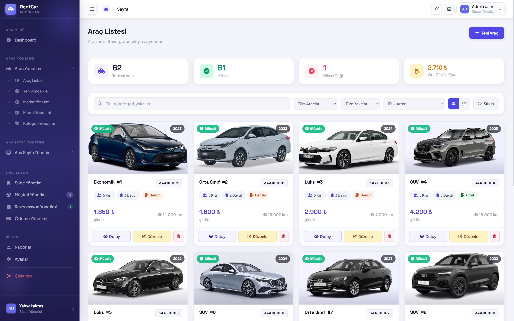 | 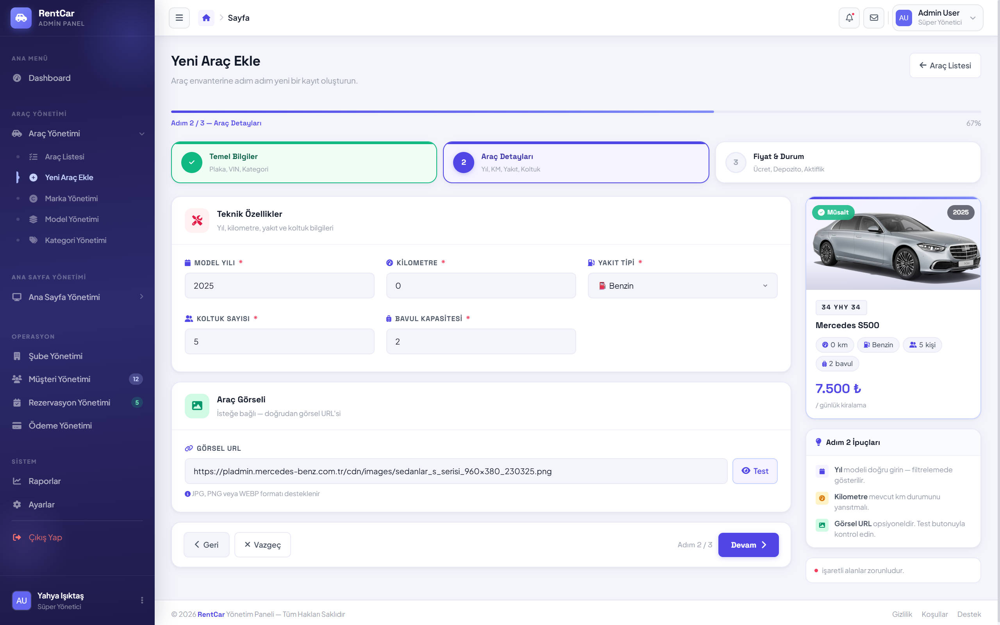 |

| Marka Yönetimi | Model Vitrini |
|:-:|:-:|
| 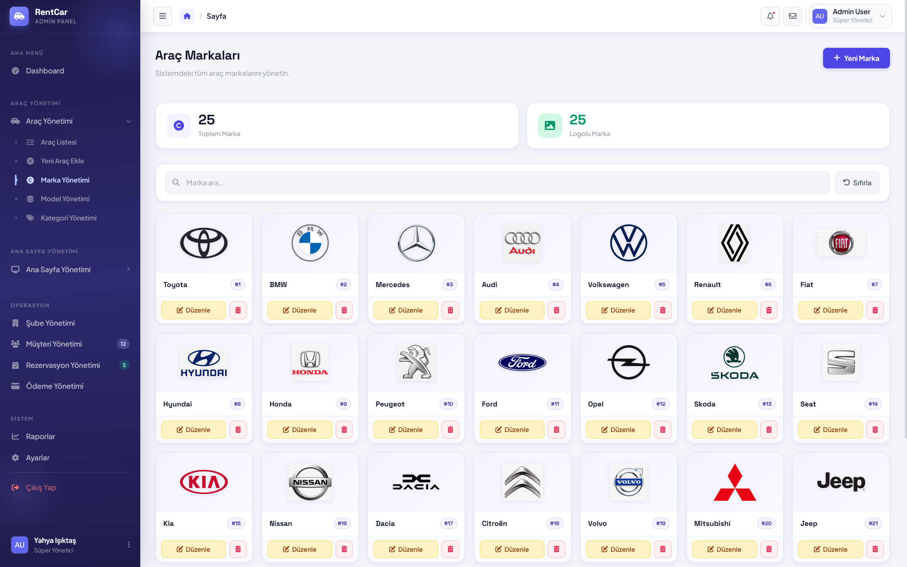 | 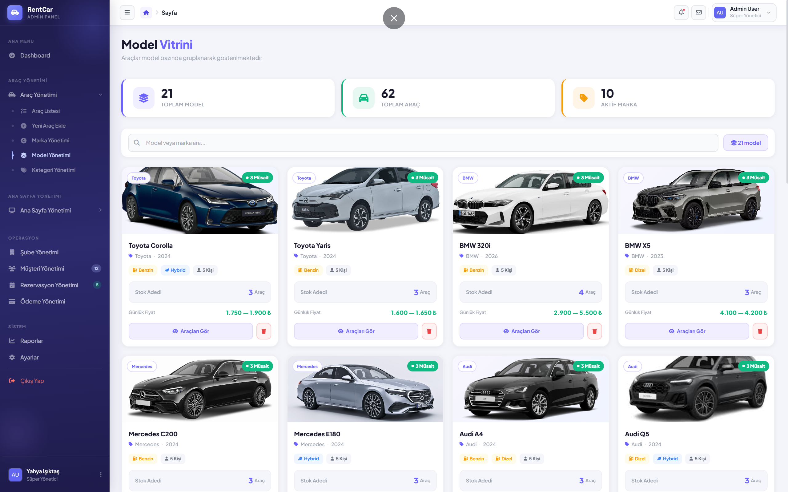 |

| Rezervasyon Yönetimi |
|:-:|
| 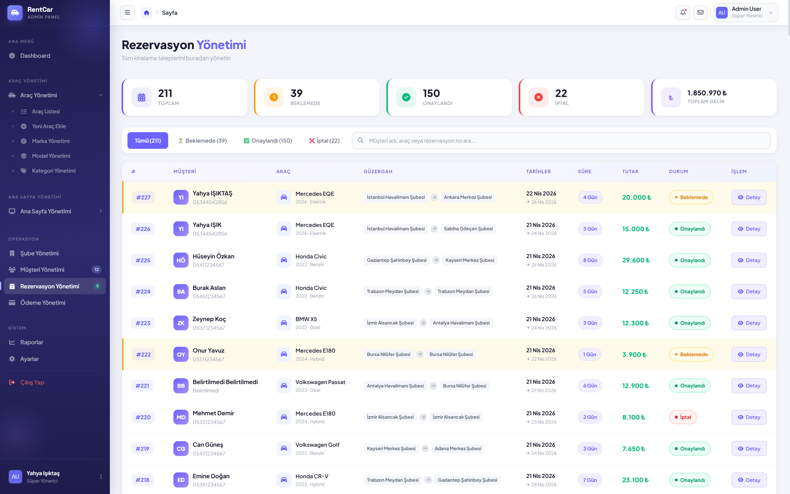 |

---

### 🚫 404 Sayfası

| Sayfa Bulunamadı |
|:-:|
| 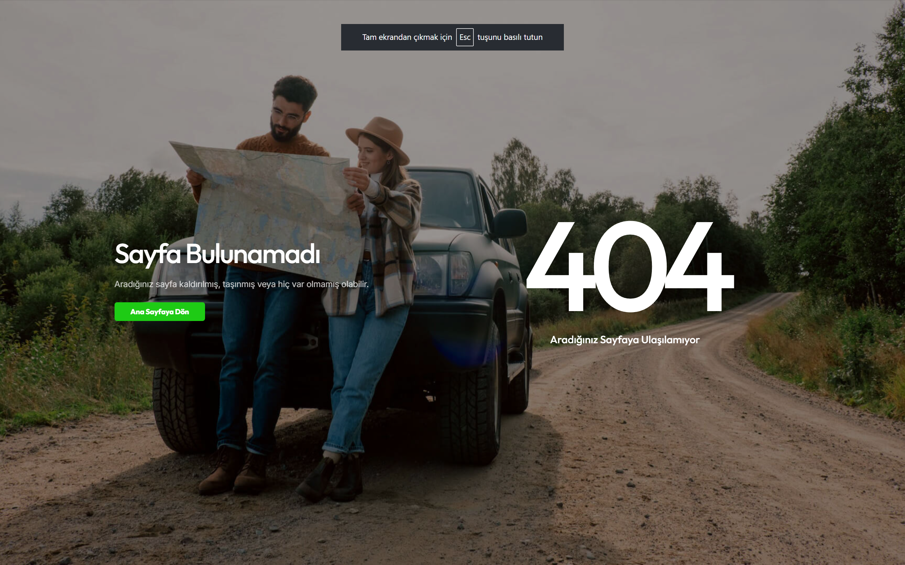 |

---

## 🧩 Uygulama Özellikleri

### 👤 Kullanıcı Arayüzü

| Özellik | Açıklama |
|---------|----------|
| 🏠 Ana Sayfa | Hero alanı, araç kategorileri, öne çıkan içerikler |
| 🚗 Araç Listesi | Şubeye, yakıt tipine, kategoriye ve fiyata göre filtreleme |
| 🔍 Araç Detay | Teknik özellikler, günlük ücret, depozito, şube bilgisi |
| 📅 Rezervasyon | Alış/dönüş şubesi, tarih seçimi ve anlık fiyat hesaplama |
| ✅ Rezervasyon Onayı | Tamamlanma ekranı, e-posta bildirimi ve indirim kodu |
| 📞 İletişim | Telefon, e-posta ve çalışma saatleri |

---

### 🛠️ Admin Paneli

| Özellik | Açıklama |
|---------|----------|
| 📊 Dashboard | Toplam araç, günlük/aylık gelir, aktif kiralama sayısı |
| 📈 Grafikler | Son 7 günlük performans çubuğu, araç doluluk ve onay oranı |
| 🚗 Araç Yönetimi | CRUD — grid görünüm, plaka, kategori, yakıt, fiyat, görsel |
| ➕ Yeni Araç Ekle | 3 adımlı form: Temel Bilgiler → Teknik Detaylar → Fiyat & Durum |
| 🏷️ Marka Yönetimi | Marka logoları, CRUD işlemleri |
| 🔧 Model Yönetimi | Model vitrini, stok adedi, günlük fiyat aralığı |
| 📅 Rezervasyon Yönetimi | Tümü / Beklemede / Onaylandı / İptal filtreleme, güzergah takibi |
| 💳 Ödeme Yönetimi | Kiralama tutarları ve ödeme durumu |
| 👥 Müşteri Yönetimi | Müşteri kayıtları ve iletişim bilgileri |
| 🏢 Şube Yönetimi | Çoklu şube desteği |
| 📊 Raporlar | Gelir ve operasyon raporları |

---

## 🏗️ Mimari & Kullanılan Teknolojiler

Bu proje **N-Katmanlı (N-Tier) Mimari** prensibiyle geliştirilmiştir.

```
RentalyProject/
├── RentalyProject.MVC/             # Kullanıcı Arayüzü + Admin Panel
├── RentalyProject.Business/        # İş Kuralları & Servisler
├── RentalyProject.DataAccess/      # EF Core, Repository, Migrations
├── RentalyProject.Entity/          # Entity Modeller
└── RentalyProject.Dto/             # DTO Sınıfları
```

### Backend

| Teknoloji | Kullanım Amacı |
|-----------|----------------|
| ASP.NET Core MVC | Admin panel ve kullanıcı arayüzü |
| Entity Framework Core | ORM — veritabanı işlemleri |
| MSSQL | İlişkisel veritabanı |
| AutoMapper | DTO ↔ Entity dönüşümleri |
| FluentValidation | Model doğrulama kuralları |

---

## ⚙️ Kurulum

```bash
# Repoyu klonla
git clone https://github.com/isiktasyahya/Rentaly-Rent-A-Car-Project.git
cd Rentaly-Rent-A-Car-Project
```

### Gereksinimler

- .NET 8 SDK
- MSSQL Server

### `appsettings.json` Yapılandırması

```json
{
  "ConnectionStrings": {
    "DefaultConnection": "Server=.;Database=RentalyDb;Trusted_Connection=True;"
  }
}
```

### Veritabanı Migration

```bash
cd RentalyProject.DataAccess
dotnet ef database update
```

### Projeyi Çalıştır

```bash
# API'yi başlat
cd RentalyProject.WebApi
dotnet run

# MVC'yi başlat (ayrı terminal)
cd RentalyProject.MVC
dotnet run
```

---

## 🌟 Proje Öne Çıkanlar

- ✅ **N-Katmanlı Mimari** — WebApi, MVC, Business, DataAccess, Entity, Dto
- ✅ **Çoklu şube desteği** — Alış ve dönüş şubesi bağımsız seçilebilir
- ✅ **Adım adım araç ekleme** — 3 adımlı akıllı form yapısı
- ✅ **Gerçek zamanlı fiyat hesaplama** — Tarih ve gün sayısına göre anlık tutar
- ✅ **Otomatik e-posta bildirimi** — Rezervasyon onayı müşteriye iletilir
- ✅ **Kapsamlı admin dashboard** — Gelir, doluluk, onay oranı tek ekranda
- ✅ **Rezervasyon durum yönetimi** — Beklemede / Onaylandı / İptal filtreleme
- ✅ **Model & Marka vitrini** — Logo yönetimi ve stok takibi
- ✅ **Özel 404 sayfası** — Temaya uygun, kullanıcı dostu hata ekranı

---

## 👤 Geliştirici

**Yahya Işıktaş**  
📧 isiktasyahya7@gmail.com  
📍 Gaziosmanpaşa / İstanbul

---

> *"Sadece araç kiralamak değil, aynı zamanda güvenli ve sorunsuz bir yolculuk deneyimi sunmak."*  
> — Rentaly
